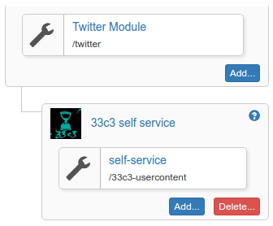

# The info-beamer hosted package running at 33c3

For 33c3 I've developed a new approach to scheduling
and layout. [Last years version](https://github.com/info-beamer/package-32c3-screens)
uses a mostly fixed layout of scroller, main content and an
optional sidebar. This version is more flexible: Basically
you can define tiles with changing sizes that show the
various content modules available. A hidding scroller can
for example easily be done by moving the slider tile out of
the screen and resizing the main content tile. All content
is schedule with a fixed duration. Multiple devices using
the same schedule will show the same tiles at the same time.
But this also means that it is not possible to have content
of variable duration. So the schedule is pretty rigid.

While everything is packaged as an
[info-beamer hosted](https://info-beamer.com/hosted)
package and the twitter, frab and scroller sub nodes
can be easily configured from the hosted interface,
the main schedule configuration is a bit clunky.
For that reason there's a configuration tools in
the `config` subdirectory which uses a custom
file format to make it easier to schedule content.

In the future a way to configure such packages from within
the info-beamer hosted configuration interface will be
developed. Stay tuned...

## Installation

The package can easily be installed within hosted by
clicking this button:

[](https://info-beamer.com/use?url=https://github.com/info-beamer/package-33c3)

Alternatively you can manually import the package from

```
https://github.com/info-beamer/package-33c3
```

## Configuration

Configuration can mostly be done within the hosted
interface. For scheduling you can adapt the examples in the
`tools` directory.

Make sure to change the `setup_id` value within those files
to match your ids.

Within the `area` definitions you can create named areas.
These areas can then be used in the schedule definition to
move content around.

Scheduling is done by adding multiple lines. Each line
starts with a duration in seconds. Using a zero here will
fold the line with the last line with a non-zero duration.
At runtime a random element from the folded lines will be
selected.

Multiple tracks can be defined by vertically aligning
playlist item definitions.

A playlist item definition looks like this:

```
frab(info_bar,{"mode":"info_bar"})
```

In this example `frab` is the name of the asset shown. It
can either be a direct subdirectory or a normal asset like
images/videos. Subdirectories must follow the "module" api
to be supported.  You can have a look at `twitter/tile.lua`
to see how that works.

In the above example `info_bar` references an area defined
earlier within the configuration.

The optional json value, in that case `{"mode":"info_bar"}`
will be available to the used module (in that case `frab`)
as the `custom` value passed to the `task` function.

Once you have a complete schedule defined, you can push that
schedule to info-beamer hosted by calling the `tools/config`
program with your schedule as first argument. Make sure to
set the `API_KEY` environment variable to your info-beamer
API key you can find in your [account page](https://info-beamer.com/account).

## Potentially useful information

### Future plans and documentation

The code itself isn't documented, so it might be a bit
difficult to follow. I tried to make everything as clear as
possible but this still isn't a substitute for proper
documentation. These congress packages are always a way to
play with new ideas without really knowing if they work out
in the end. It seems like this years version worked pretty
well, so I'll probably further develop the approach taken in
this package so it will end up being fully supported and
documented. But that might take some time.

Getting all of this to run in the current state might be
a bit complicated. But it should work. If you need help for
your conference, please get in
[contact](https://info-beamer.com/contact).

### Adding more content

This package can be easily extended by adding sub packages
and referencing them from the schedule. During 33c3 this
approach was used for the user content that was being
uploaded to
[33c3.infobeamer.com](https://github.com/info-beamer/33c3-cms).
This custom CMS exported its content as an info-beamer
hosted package that can added as a child package this this
package. It can then be referenced from the schedule.
During 33c3 the sub package was added in the
`33c3-usercontent` folder.  You can still see that in the
config examples in the `tools` directory.


